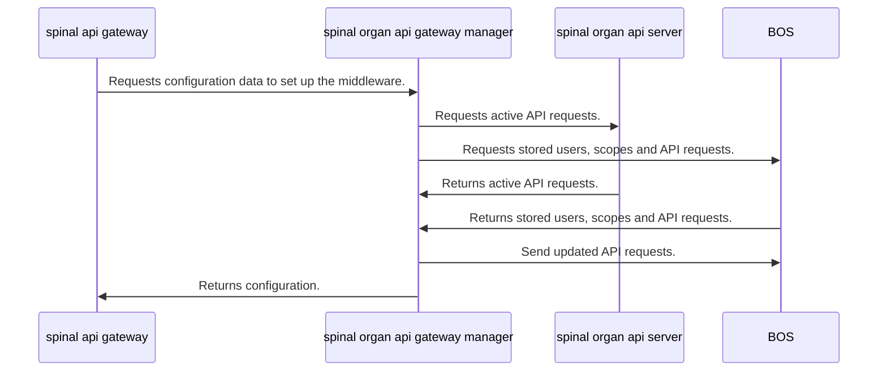
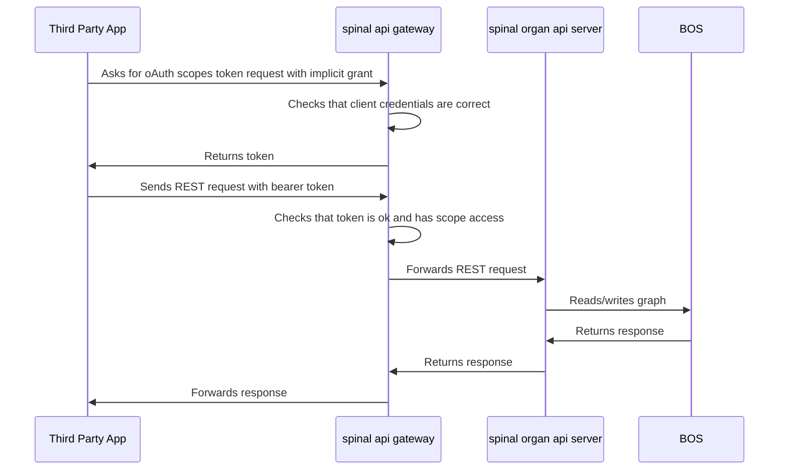

# spinal-platform-monitoring

## Overview

This package offers a REST and oAuth2 development interface so third-party developers and organizations are able to build products that interact with the BOS.

For reading diagrams, mermaid.js is used (please, check for plugins in Visual Studio or online viewers).

## Configuring the API Gateway Organ

## Generating API Documentation

TODO

## Roadmap

### MVP

- ~~Sync spinal-api-gateway configuration with BOS and store it using SpinalGraph~~
- Basic UI for configuration
- ~~Define and expose essential API Requests~~
- ~~Setup for production ready (swagger, config, etc)~~
- Integrate this package with ZIP bundle

### Upcoming

- ~~Organize better the spinal-organ-api-server module in routers and sub-folders~~
- ~~Modularize spinal-organ-api-server and spinal-organ-api-gateway-manager in separate processes~~

## Collaboration

### Architecture

The API Gateway is in the middle between Third Party Applications and the BOS.

It is composed by 3 nodes:

- **spinal-api-gateway** - Based on [Express-Gateway](https://www.express-gateway.io/), handles access control and authorization, and acts as a proxy of the REST requests.
- **spinal-organ-api-gateway-manager** - Synchronizes configuration data stored in the BOS with spinal-api-gateway.
- **spinal-organ-api-server** - Contains the REST endpoints to be consumed and exposed by spinal-api-gateway. The apps don't interact directly with this node, but through the spinal-api-gateway.

#### Setup sequence



#### REST request sequence



#### A note in synchronization in configuration

Most of the configuration updates performed by the Gateway Manager are "replacements". This means that when an object is updated, the whole object is replaced by a new one with the updated attributes.

### Branches

- **master** - latest production ready version
- **release-\*** - release version candidates
- **dev** - code in development stage
- **dev-** - specific features, bugs, enhancements branches

### Testing

For unit testing, Jest is used. To run the tests:

```
npm test
```
